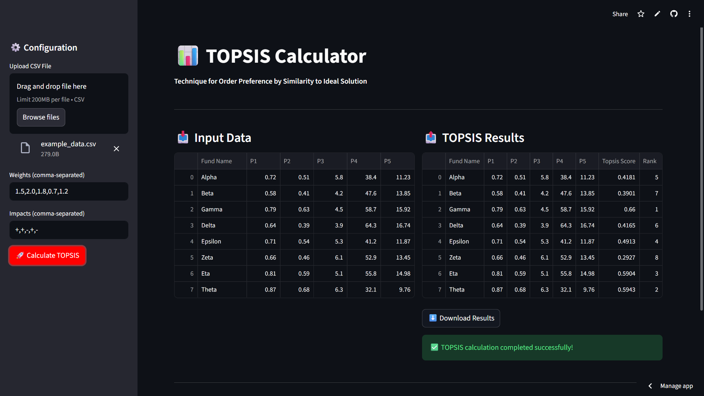

# Topsis-VRITI-102313063

**TOPSIS** (Technique for Order Preference by Similarity to Ideal Solution) by **VRITI MARWAHA** (Roll 102313063)

---

## 1. Methodology

TOPSIS is a multi-criteria decision-making (MCDM) method that ranks alternatives based on their geometric distance from the ideal solution.

**Algorithm Steps:**

1. **Normalize** the decision matrix using vector normalization
2. **Apply weights** to each criterion based on importance
3. **Identify ideal best and worst** solutions for each criterion
4. **Calculate Euclidean distances** to ideal best and worst
5. **Compute relative closeness** (TOPSIS score: 0-1 range)
6. **Rank alternatives** where Rank 1 = best choice

---

## 2. Description

This project provides both a **command-line tool** and a **web interface** for performing TOPSIS analysis.

**Features:**
- Upload CSV data with alternatives and multiple criteria
- Assign weights to reflect criterion importance
- Specify impacts (beneficial or cost) for each criterion
- Get ranked results with TOPSIS scores
- Download results as CSV

**Technology Stack:**
- NumPy for fast vectorized computations
- Pandas for robust data handling
- Streamlit for interactive web interface

---

## 3. Input / Output

### Input

- **CSV File**: First column = alternative names, remaining columns = numeric criteria values
- **Weights**: Comma-separated numbers (e.g., `2.3,1.7,3.1,0.9,2.6`)
- **Impacts**: Comma-separated `+` (beneficial) or `-` (cost) for each criterion (e.g., `+,-,+,-,+`)

### Output

- **CSV File**: Original data + two new columns:
  - `Topsis Score`: Relative closeness coefficient (0-1)
  - `Rank`: Ranking based on score (1 = best)

**Example:**

| Fund Name | P1   | P2   | P3  | P4   | P5    | Topsis Score | Rank |
|-----------|------|------|-----|------|-------|--------------|------|
| Zeta      | 0.66 | 0.46 | 6.1 | 52.9 | 13.45 | 0.6216       | 1    |
| Eta       | 0.81 | 0.59 | 5.1 | 55.8 | 14.98 | 0.5669       | 2    |
| Alpha     | 0.72 | 0.51 | 5.8 | 38.4 | 11.23 | 0.5337       | 3    |

---

## 4. Live Link

**🚀 Live Demo:** 
<https://vriti28.streamlit.app/>

---

## 5. Screenshot of Interface



---

## 📦 Repository

<https://github.com/vritimarwah28/Assignment-Topsis.git>

---

## 🚀 Installation & Usage

### Prerequisites
```bash
python >= 3.9
```

### Install Dependencies
```bash
pip install -r requirements.txt
```

### Run Web App
```bash
streamlit run app.py
```

### Run CLI
```bash
python -m topsis_angad example_data.csv "2.3,1.7,3.1,0.9,2.6" "+,-,+,-,+" output.csv
```

---

## 📄 License

MIT License

## 👤 Author

VRITI MARWAHA - Roll No. 102313063
